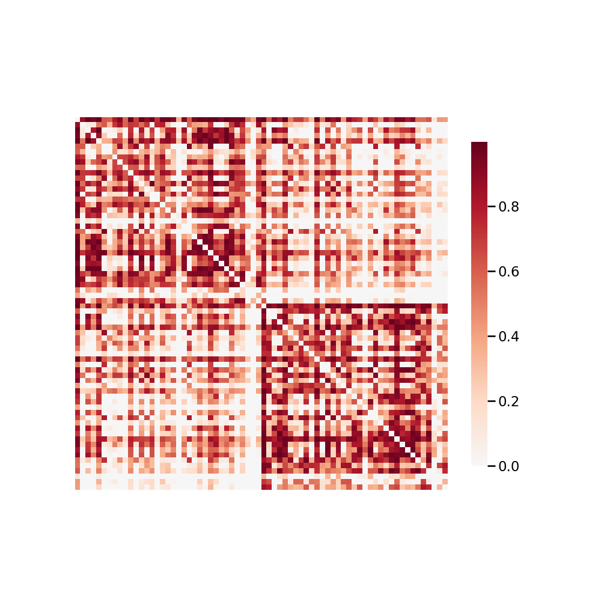

.. m2g_data documentation master file, created by
   sphinx-quickstart on Tue Mar 10 15:24:51 2020.
   You can adapt this file completely to your liking, but it should at least
   contain the root `toctree` directive.

******************
ABIDEII-BNI_1
******************

Overview
-----------

Autism Brain Imaging Data Exchange II  -  Barrow Neurological Institute

See http://fcon_1000.projects.nitrc.org/indi/abide/abide_II.html for the website of the original dataset

**Sample Connectome** from sub-29044_ses-1_dwi_desikan_space-MNI152NLin6_res-2x2x2_connectome.png

All Data Download Instructions
-------------------------------------

Download from S3

The most recently published snapshot can be downloaded from S3. This method is best for larger datasets or unstable connections. This example uses AWS CLI: https://aws.amazon.com/cli/?nc1=h_ls/

**Diffusion MRI result**::

	aws s3 sync --no-sign-request s3://ndmg-data/ABIDEII-BNI_1/ABIDEII-BNI_1-m2g-dwi-04-15-20-csa-det-native <your_local_direction>
	
example: aws s3 sync \--no-sign-request s3://ndmg-data/ABIDEII-BNI_1/ABIDEII-BNI_1-m2g-dwi-04-15-20-csa-det-native .

	
**Functional MRI result**::

	aws s3 sync --no-sign-request s3://ndmg-data/ABIDEII-BNI_1/ABIDEII-BNI_1-m2g-func-04-15-20 <your_local_direction>
	
example: aws s3 sync --no-sign-request s3://ndmg-data/ABIDEII-BNI_1/ABIDEII-BNI_1-m2g-func-04-15-20 .

Single Sample Download Instructions
----------------------------------------

**Diffusion MRI single sample**::
    
    aws s3 sync --no-sign-request s3://ndmg-data/BNU1/BNU1-2-8-20-m2g_staging-native-csa-det/<subject_number> <your_local_direction>

example: aws s3 sync --no-sign-request s3://ndmg-data/BNU1/BNU1-2-8-20-m2g_staging-native-csa-det/sub-0025864 .

======	==============================
order	subject_number
======	==============================
1    	sub-0025864
2    	sub-0025865
