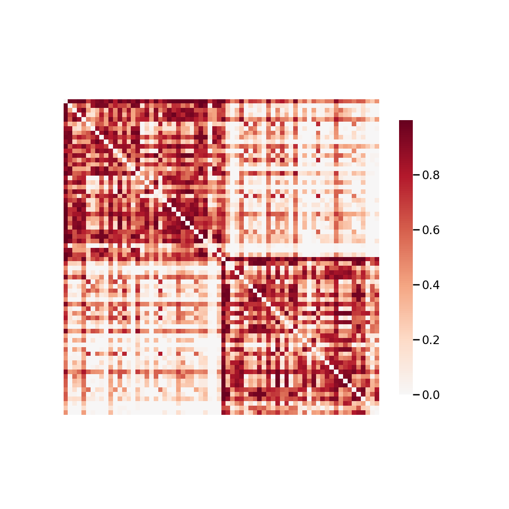

.. m2g_data documentation master file, created by
   sphinx-quickstart on Tue Mar 10 15:24:51 2020.
   You can adapt this file completely to your liking, but it should at least
   contain the root `toctree` directive.

******************
ABIDEII-SDSU_1
******************

Overview
-----------

Autism Brain Imaging Data Exchange II  -  San Diego State University

See http://fcon_1000.projects.nitrc.org/indi/abide/abide_II.html for the website of the original dataset

**Sample Connectome** from sub-28867_ses-1_dwi_desikan_space-MNI152NLin6_res-2x2x2_connectome.png

All Data Download Instructions
-------------------------------------

Download from S3

The most recently published snapshot can be downloaded from S3. This method is best for larger datasets or unstable connections. This example uses AWS CLI: https://aws.amazon.com/cli/?nc1=h_ls/

**Diffusion MRI result**::

	aws s3 sync --no-sign-request s3://ndmg-data/ABIDEII-SDSU_1/ABIDEII-SDSU_1-m2g-dwi-05-03-20-csa-det-native <your_local_direction>
	
Example: aws s3 sync \* --no-sign-request s3://ndmg-data/ABIDEII-SDSU_1/ABIDEII-SDSU_1-m2g-dwi-05-03-20-csa-det-native .

	
**Functional MRI result**::

	aws s3 sync --no-sign-request s3://ndmg-data/ABIDEII-SDSU_1/ABIDEII-SDSU_1-m2g-func-04-15-20 <your_local_direction>
	
Example: aws s3 sync \*--no-sign-request s3://ndmg-data/ABIDEII-SDSU_1/ABIDEII-SDSU_1-m2g-func-04-15-20 .

Single Sample Download Instructions
----------------------------------------

**Diffusion MRI single sample**::
    
    aws s3 sync \--\no-sign-request s3://ndmg-data/ABIDEII-SDSU_1/ABIDEII-SDSU_1-m2g-dwi-05-03-20-csa-det-native/<subject_number> <your_local_direction>

Example: aws s3 sync --no-sign-request s3://ndmg-data/ABIDEII-SDSU_1/ABIDEII-SDSU_1-m2g-dwi-05-03-20-csa-det-native/sub-29011 .

=====	==============================
index	subject_number
=====	==============================
1    	sub-29011
26    	sub-29056
27    	sub-29146
28    	sub-29147
29		sub-29149
=====	==============================

**Functional MRI single sample**::
    
    aws s3 sync --no-sign-request s3://ndmg-data/ABIDEII-SDSU_1/ABIDEII-SDSU_1-m2g-func-04-15-20/<subject_number> <your_local_direction>

Example: aws s3 sync --no-sign-request s3://ndmg-data/ABIDEII-SDSU_1/ABIDEII-SDSU_1-m2g-func-04-15-20/sub-0025864 .

=====	==============================
index	subject_number
=====	==============================
1    	sub-29011
2    	sub-29014
3    	sub-29016