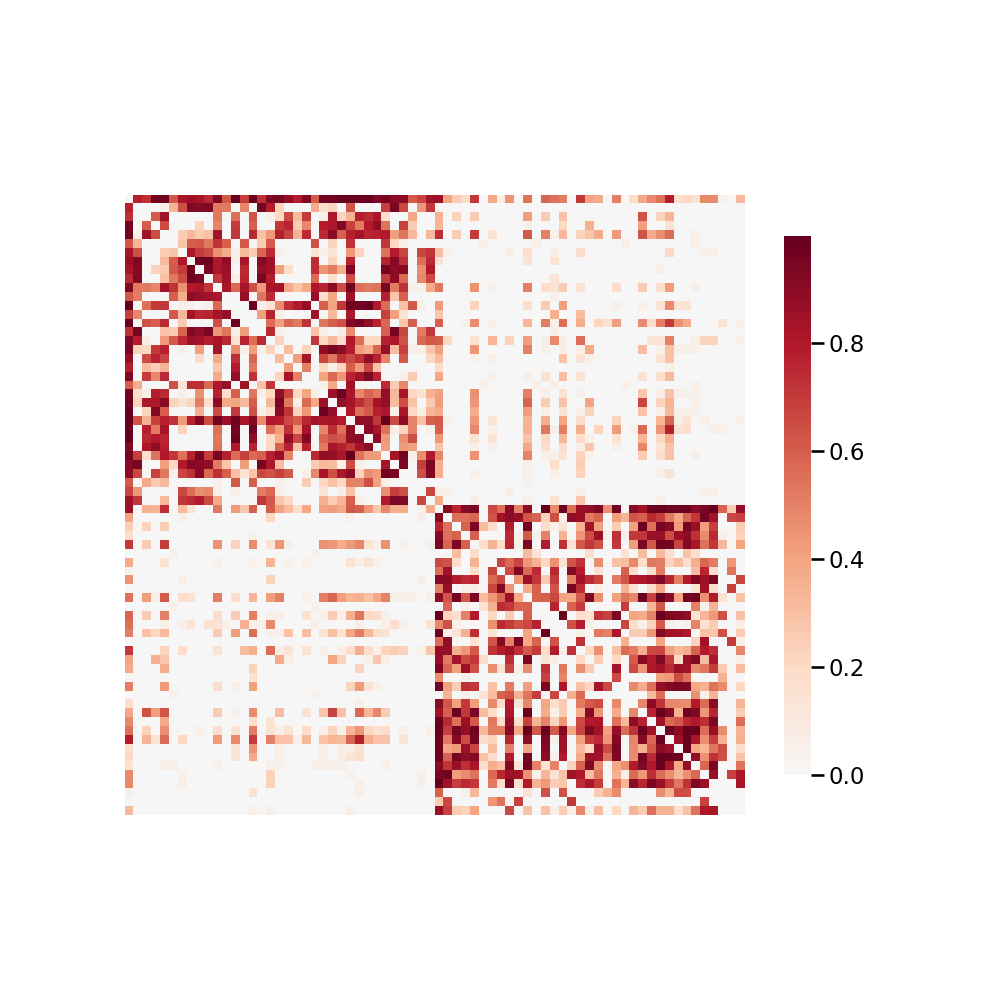

.. m2g_data documentation master file, created by
   sphinx-quickstart on Tue Mar 10 15:24:51 2020.
   You can adapt this file completely to your liking, but it should at least
   contain the root `toctree` directive.

******************
BNU1
******************

Overview
-----------

Connectivity-based Brain Imaging Research Database (C-BIRD) at BNU

See http://fcon_1000.projects.nitrc.org/indi/CoRR/html/bnu_1.html for the website of the original dataset

**Sample Connectome** from sub-0025866_ses-1_dwi_desikan_space-MNI152NLin6_res-2x2x2_connectome.png

All Data Download Instructions
-------------------------------------

Download from S3

The most recently published snapshot can be downloaded from S3. This method is best for larger datasets or unstable connections. This example uses AWS CLI: https://aws.amazon.com/cli/?nc1=h_ls/

**Diffusion MRI result**::

	aws s3 sync --no-sign-request s3://ndmg-data/BNU1/BNU1-2-8-20-m2g_staging-native-csa-det <your_local_direction>
	
	
Example: 

``aws s3 sync --no-sign-request s3://ndmg-data/BNU1/BNU1-2-8-20-m2g_staging-native-csa-det .``

	
	
**Functional MRI result**::

    aws s3 sync --no-sign-request s3://ndmg-data/BNU1/BNU1-m2g-func-04-15-20 <your_local_direction>
	
	
Example: 

``aws s3 sync --no-sign-request s3://ndmg-data/BNU1/BNU1-m2g-func-04-15-20 .``

Single Sample Download Instructions
----------------------------------------

**Diffusion MRI single sample**::
    
    aws s3 sync --no-sign-request s3://ndmg-data/BNU1/BNU1-2-8-20-m2g_staging-native-csa-det/<subject_number> <your_local_direction>

Example: 

``aws s3 sync --no-sign-request s3://ndmg-data/BNU1/BNU1-2-8-20-m2g_staging-native-csa-det/sub-0025864 .``

======	==============================
index	subject_number
======	==============================
1    	sub-0025864
2    	sub-0025865
3    	sub-0025866
4    	sub-0025867
5    	sub-0025868
6    	sub-0025869
7    	sub-0025870
8    	sub-0025871
9		sub-0025872
10    	sub-0025873
11    	sub-0025874
12    	sub-0025875
13    	sub-0025876
14    	sub-0025877
15    	sub-0025878
16    	sub-0025879
17    	sub-0025880
18    	sub-0025881
19		sub-0025882
20    	sub-0025883
21    	sub-0025884
22    	sub-0025885
23    	sub-0025886
24    	sub-0025887
25    	sub-0025888
26    	sub-0025889
27    	sub-0025890
28    	sub-0025891
29		sub-0025892
30    	sub-0025893
31    	sub-0025894
32    	sub-0025895
33    	sub-0025896
34    	sub-0025897
35    	sub-0025898
36    	sub-0025899
37    	sub-0025900
38    	sub-0025901
39		sub-0025902
40    	sub-0025903
41    	sub-0025904
42    	sub-0025905
43    	sub-0025906
44    	sub-0025907
45    	sub-0025908
46    	sub-0025909
47    	sub-0025910
48    	sub-0025911
49		sub-0025912
50    	sub-0025913
51    	sub-0025914
52    	sub-0025915
53    	sub-0025916
54    	sub-0025917
55    	sub-0025918
56    	sub-0025919
57    	sub-0025920
======	==============================

**Functional MRI single sample**::
    
    aws s3 sync --no-sign-request s3://ndmg-data/BNU1/BNU1-m2g-func-04-15-20/<subject_number> <your_local_direction>

Example: 

``aws s3 sync --no-sign-request s3://ndmg-data/BNU1/BNU1-m2g-func-04-15-20/sub-0025864 .``

======	==============================
index	subject_number
======	==============================
1    	sub-0025864
2    	sub-0025865
3    	sub-0025866
4    	sub-0025867
5    	sub-0025868
6    	sub-0025869
7    	sub-0025870
8    	sub-0025871
9		sub-0025872
10    	sub-0025873
11    	sub-0025874
12    	sub-0025875
13    	sub-0025876
14    	sub-0025877
15    	sub-0025878
16    	sub-0025879
17    	sub-0025880
18    	sub-0025881
19		sub-0025882
20    	sub-0025883
21    	sub-0025884
22    	sub-0025885
23    	sub-0025886
24    	sub-0025887
25    	sub-0025888
26    	sub-0025889
27    	sub-0025890
28    	sub-0025891
29		sub-0025892
30    	sub-0025893
31    	sub-0025894
32    	sub-0025895
33    	sub-0025896
34    	sub-0025897
35    	sub-0025898
36    	sub-0025899
37    	sub-0025900
38    	sub-0025901
39		sub-0025902
40    	sub-0025903
41    	sub-0025904
42    	sub-0025905
43    	sub-0025906
44    	sub-0025907
45    	sub-0025908
46    	sub-0025909
47    	sub-0025910
48    	sub-0025911
49		sub-0025912
50    	sub-0025913
51    	sub-0025914
52    	sub-0025915
53    	sub-0025916
54    	sub-0025917
55    	sub-0025918
56    	sub-0025919
57    	sub-0025920
======	==============================