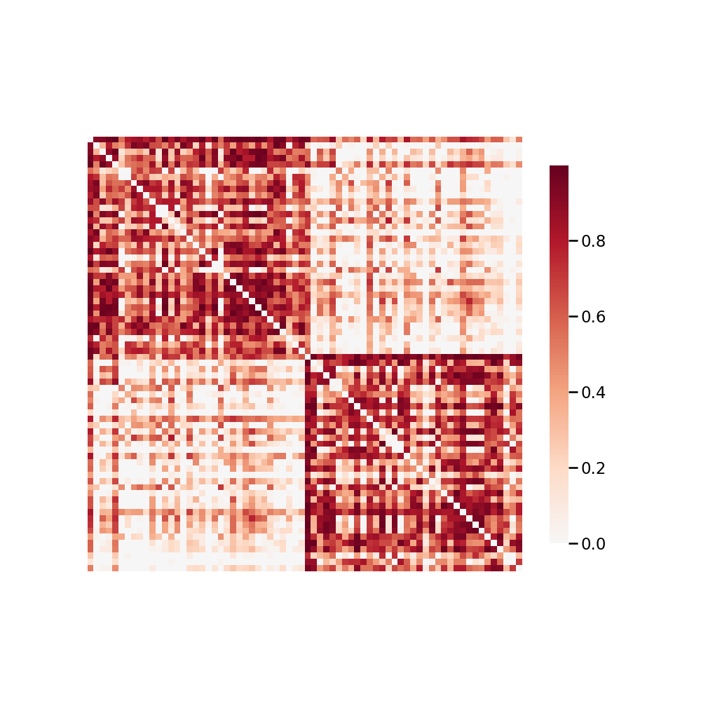

.. m2g_data documentation master file, created by
   sphinx-quickstart on Tue Mar 10 15:24:51 2020.
   You can adapt this file completely to your liking, but it should at least
   contain the root `toctree` directive.

******************
BNU3
******************

Overview
-----------

Connectivity-based Brain Imaging Research Database (C-BIRD) at BNU

See http://fcon_1000.projects.nitrc.org/indi/CoRR/html/bnu_3.html for the website of the original dataset

**Sample Connectome** from sub-0027058_ses-1_dwi_desikan_space-MNI152NLin6_res-2x2x2_connectome.png

All Data Download Instructions
-------------------------------------

Download from S3

The most recently published snapshot can be downloaded from S3. This method is best for larger datasets or unstable connections. This example uses AWS CLI: https://aws.amazon.com/cli/?nc1=h_ls/

**Diffusion MRI result**::

	aws s3 sync --no-sign-request s3://ndmg-data/BNU3/BNU3-m2g-04-05-20_dwi_csa_det_local_native <your_local_direction>
	
	
Example: 

``aws s3 sync --no-sign-request s3://ndmg-data/BNU3/BNU3-m2g-04-05-20_dwi_csa_det_local_native .``

	
	
**Functional MRI result**::

    aws s3 sync --no-sign-request s3://ndmg-data/BNU3/BNU3-m2g-func-04-15-20 <your_local_direction>
	
	
Example: 

``aws s3 sync --no-sign-request s3://ndmg-data/BNU3/BNU3-m2g-func-04-15-20 .``

Single Sample Download Instructions
----------------------------------------

**Diffusion MRI single sample**::
    
    aws s3 sync --no-sign-request s3://ndmg-data/BNU3/BNU3-m2g-04-05-20_dwi_csa_det_local_native/<subject_number> <your_local_direction>

Example: 

``aws s3 sync --no-sign-request s3://ndmg-data/BNU3/BNU3-m2g-04-05-20_dwi_csa_det_local_native/sub-0027055 .``

======	==============================
index	subject_number
======	==============================
1    	sub-0027055
2    	sub-0027056
3    	sub-0027057
4    	sub-0027058
5    	sub-0027059
6    	sub-0027060
7    	sub-0027061
8    	sub-0027062
9		sub-0027063
10    	sub-0027064
11    	sub-0027065
12    	sub-0027066
13    	sub-0027067
14    	sub-0027068
15    	sub-0027069
16    	sub-0027070
17    	sub-0027071
18    	sub-0027072
19		sub-0027073
20    	sub-0027074
21    	sub-0027075
22    	sub-0027076
23    	sub-0027078
24    	sub-0027079
25    	sub-0027080
26    	sub-0027081
27    	sub-0027082
28    	sub-0027083
29		sub-0027084
30    	sub-0027085
31    	sub-0027086
32    	sub-0027087
33    	sub-0027088
34    	sub-0027089
35    	sub-0027090
36    	sub-0027091
37    	sub-0027092
38    	sub-0027093
39		sub-0027094
40    	sub-0027095
41    	sub-0027096
42    	sub-0027097
43    	sub-0027099
44    	sub-0027100
45    	sub-0027101
46    	sub-0027102
======	==============================

**Functional MRI single sample**::
    
    aws s3 sync --no-sign-request s3://ndmg-data/BNU3/BNU3-m2g-func-04-15-20/<subject_number> <your_local_direction>

Example: 

``aws s3 sync --no-sign-request s3://ndmg-data/BNU3/BNU3-m2g-func-04-15-20/sub-0027055 .``

======	==============================
index	subject_number
======	==============================
1    	sub-0027055
2    	sub-0027056
3    	sub-0027057
4    	sub-0027058
5    	sub-0027059
6    	sub-0027060
7    	sub-0027061
8    	sub-0027062
9		sub-0027063
10    	sub-0027064
11    	sub-0027065
12    	sub-0027066
13    	sub-0027067
14    	sub-0027068
15    	sub-0027069
16    	sub-0027070
17    	sub-0027071
18    	sub-0027072
19		sub-0027073
20    	sub-0027074
21    	sub-0027075
22    	sub-0027076
23    	sub-0027077
24    	sub-0027078
25    	sub-0027079
26    	sub-0027080
27    	sub-0027081
28    	sub-0027082
29		sub-0027083
30    	sub-0027084
31    	sub-0027085
32    	sub-0027086
33    	sub-0027087
34    	sub-0027088
35    	sub-0027089
36    	sub-0027090
37    	sub-0027091
38    	sub-0027092
39		sub-0027093
40    	sub-0027094
41    	sub-0027095
42    	sub-0027096
43    	sub-0027097
44    	sub-0027098
45    	sub-0027099
46    	sub-0027100
47    	sub-0027101
48    	sub-0027102
======	==============================