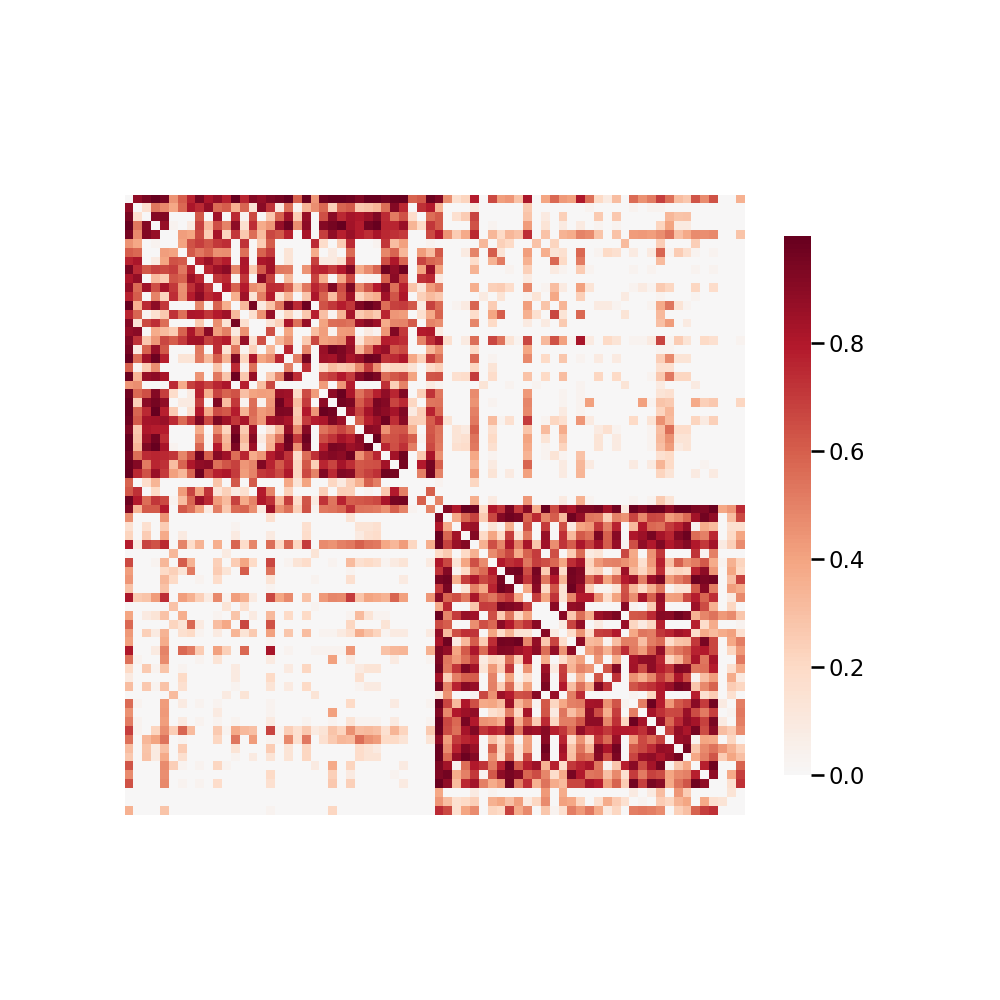

.. m2g_data documentation master file, created by
   sphinx-quickstart on Tue Mar 10 15:24:51 2020.
   You can adapt this file completely to your liking, but it should at least
   contain the root `toctree` directive.

******************
HNU1
******************

Overview
-----------

Connectivity-based Brain Imaging Research Database (C-BIRD) at HNU

See http://fcon_1000.projects.nitrc.org/indi/CoRR/html/hnu_1.html for the website of the original dataset

**Sample Connectome** from sub-0025431_ses-1_dwi_desikan_space-MNI152NLin6_res-2x2x2_connectome.png

All Data Download Instructions
-------------------------------------

Download from S3

The most recently published snapshot can be downloaded from S3. This method is best for larger datasets or unstable connections. This example uses AWS CLI: https://aws.amazon.com/cli/?nc1=h_ls/

**Diffusion MRI result**::

	aws s3 sync --no-sign-request s3://ndmg-data/HNU1/HNU1-2-8-20-m2g_staging-native-csa-det <your_local_direction>
	
example: aws s3 sync --no-sign-request s3://ndmg-data/HNU1/HNU1-2-8-20-m2g_staging-native-csa-det .

	
	

Single Sample Download Instructions
----------------------------------------

**Diffusion MRI single sample**::
    
    aws s3 sync --no-sign-request s3://ndmg-data/HNU1/HNU1-2-8-20-m2g_staging-native-csa-det/<subject_number> <your_local_direction>

example: aws s3 sync --no-sign-request s3://ndmg-data/HNU1/HNU1-2-8-20-m2g_staging-native-csa-det/sub-0025427 .

======	==============================
order	subject_number
======	==============================
1    	sub-0025427
2    	sub-0025428
3    	sub-0025429
4    	sub-0025430
5    	sub-0025431
6    	sub-0025432
7    	sub-0025433
8    	sub-0025434
9		sub-0025435
10    	sub-0025436
11    	sub-0025437
12    	sub-0025438
13    	sub-0025439
14    	sub-0025440
15    	sub-0025441
16    	sub-0025442
17    	sub-0025443
18    	sub-0025444
19		sub-0025445
20    	sub-0025446
21    	sub-0025447
22    	sub-0025448
23    	sub-0025449
24    	sub-0025450
25    	sub-0025451
26    	sub-0025452
27    	sub-0025453
28    	sub-0025454
29		sub-0025455
30    	sub-0025456
======	==============================

