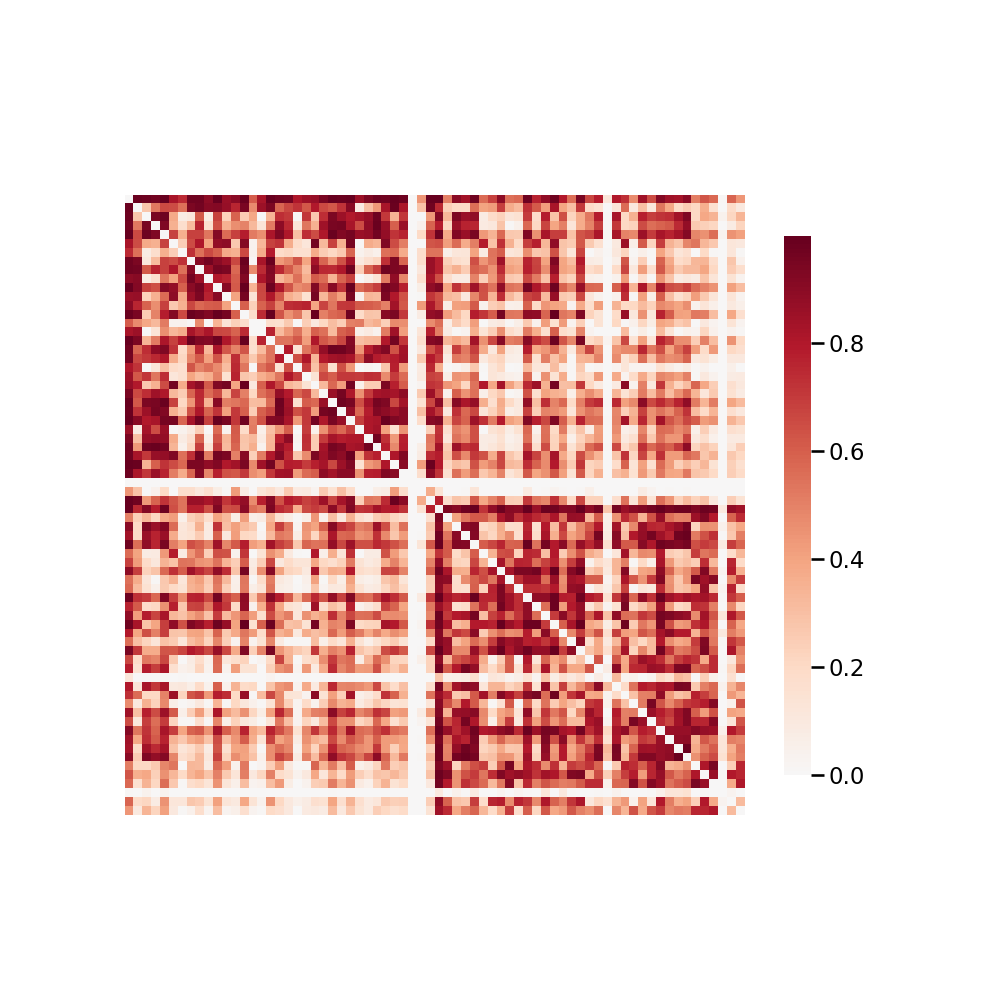

.. m2g_data documentation master file, created by
   sphinx-quickstart on Tue Mar 10 15:24:51 2020.
   You can adapt this file completely to your liking, but it should at least
   contain the root `toctree` directive.

******************
MRN1
******************

Overview
-----------

MRN - Mind Research Network

See http://fcon_1000.projects.nitrc.org/indi/CoRR/html/mrn_1.html for the website of the original dataset

**Sample Connectome** from sub-0027019_ses-2_dwi_desikan_space-MNI152NLin6_res-2x2x2_connectome.png

All Data Download Instructions
-------------------------------------

Download from S3

The most recently published snapshot can be downloaded from S3. This method is best for larger datasets or unstable connections. This example uses AWS CLI: https://aws.amazon.com/cli/?nc1=h_ls/

**Diffusion MRI result**::

	aws s3 sync --no-sign-request s3://ndmg-data/MRN_1/MRN_1-m2g-dwi-05-03-20-csa-det-native <your_local_direction>
	
	
Example: 

``aws s3 sync --no-sign-request s3://ndmg-data/MRN_1/MRN_1-m2g-dwi-05-03-20-csa-det-native .``

	
	
**Functional MRI result**::

    aws s3 sync --no-sign-request s3://ndmg-data/MRN_1/MRN_1-m2g-func-04-15-20 <your_local_direction>
	
	
Example: 

``aws s3 sync --no-sign-request s3://ndmg-data/MRN_1/MRN_1-m2g-func-04-15-20 .``

Single Sample Download Instructions
----------------------------------------

**Diffusion MRI single sample**::
    
    aws s3 sync --no-sign-request s3://ndmg-data/MRN_1/MRN_1-m2g-dwi-05-03-20-csa-det-native/<subject_number> <your_local_direction>

Example: 

``aws s3 sync --no-sign-request s3://ndmg-data/MRN_1/MRN_1-m2g-dwi-05-03-20-csa-det-native/sub-0027010 .``

======	==============================
index	subject_number
======	==============================
1    	sub-0027010
2    	sub-0027014
3    	sub-0027015
4    	sub-0027018
5    	sub-0027019
6    	sub-002721
7    	sub-002722
8    	sub-002724
9		sub-002728
10    	sub-002732
======	==============================

**Functional MRI single sample**::
    
    aws s3 sync --no-sign-request s3://ndmg-data/MRN_1/MRN_1-m2g-func-04-15-20/<subject_number> <your_local_direction>

Example: 

``aws s3 sync --no-sign-request s3://ndmg-data/MRN_1/MRN_1-m2g-func-04-15-20/sub-0027010 .``

======	==============================
index	subject_number
======	==============================
1    	sub-0027010
2    	sub-0027011
3    	sub-0027012
4    	sub-0027013
5    	sub-0027014
6    	sub-0027015
7    	sub-0027016
8    	sub-0027017
9		sub-0027018
10    	sub-0027019
11    	sub-0027020
12    	sub-0027021
13    	sub-0027022
14    	sub-0027023
15    	sub-0027024
16    	sub-0027025
17    	sub-0027026
18    	sub-0027027
19		sub-0027028
20    	sub-0027029
21    	sub-0027030
22    	sub-0027031
23    	sub-0027032
24    	sub-0027033
25    	sub-0027035
26    	sub-0027036
27    	sub-0027037
28    	sub-0027038
29		sub-0027039
30    	sub-0027040
31    	sub-0027041
32    	sub-0027042
33    	sub-0027043
34    	sub-0027044
35    	sub-0027045
36    	sub-0027046
37    	sub-0027047
38    	sub-0027048
39		sub-0027049
40    	sub-0027050
41    	sub-0027051
42    	sub-0027052
43    	sub-0027053
44    	sub-0027054
45    	sub-0027410
46    	sub-0027411
47    	sub-0027412
48    	sub-0027413
49		sub-0027415
50    	sub-0027416
51    	sub-0027417
52    	sub-0027418
53    	sub-0027419
======	==============================
