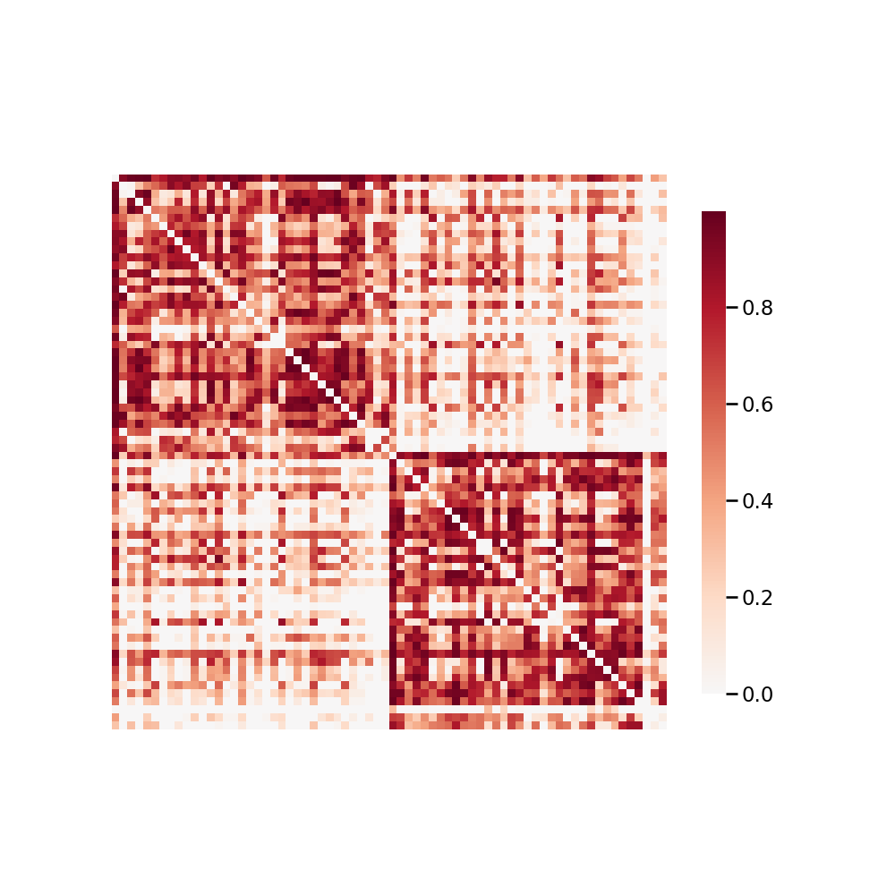

.. m2g_data documentation master file, created by
   sphinx-quickstart on Tue Mar 10 15:24:51 2020.
   You can adapt this file completely to your liking, but it should at least
   contain the root `toctree` directive.

******************
NKI1
******************

Overview
-----------

NKI - Nathan Kline Institute (Milham, Colcombe)

See http://fcon_1000.projects.nitrc.org/indi/CoRR/html/nki_1.html for the website of the original dataset

**Sample Connectome** from sub-0021006_ses-1_dwi_desikan_space-MNI152NLin6_res-2x2x2_connectome.png

All Data Download Instructions
-------------------------------------

Download from S3

The most recently published snapshot can be downloaded from S3. This method is best for larger datasets or unstable connections. This example uses AWS CLI: https://aws.amazon.com/cli/?nc1=h_ls/

**Diffusion MRI result**::

	aws s3 sync --no-sign-request s3://ndmg-data/NKI1/NKI1-2-8-20-m2g_staging-native-csa-det <your_local_direction>
	
Example: 

``aws s3 sync --no-sign-request s3://ndmg-data/NKI1/NKI1-2-8-20-m2g_staging-native-csa-det .``

	
	

Single Sample Download Instructions
----------------------------------------

**Diffusion MRI single sample**::
    
    aws s3 sync --no-sign-request s3://ndmg-data/NKI1/NKI1-2-8-20-m2g_staging-native-csa-det/<subject_number> <your_local_direction>

Example: 

``aws s3 sync --no-sign-request s3://ndmg-data/NKI1/NKI1-2-8-20-m2g_staging-native-csa-det/sub-0021001 .``

======	==============================
index	subject_number
======	==============================
1    	sub-0021001
2    	sub-0021002
3    	sub-0021006
4    	sub-0021018
5    	sub-0021024
6    	sub-1793622
7    	sub-1961098
8    	sub-2475376
9		sub-2842950
10    	sub-3201815
11    	sub-3313349
12    	sub-3315657
13    	sub-3795193
14    	sub-3808535
15    	sub-4176156
16    	sub-7055197
17    	sub-8735778
18    	sub-9630905
======	==============================
