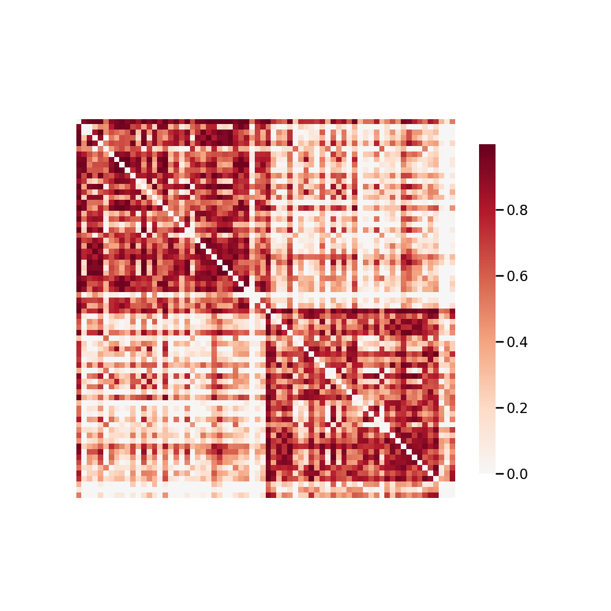

.. m2g_data documentation master file, created by
   sphinx-quickstart on Tue Mar 10 15:24:51 2020.
   You can adapt this file completely to your liking, but it should at least
   contain the root `toctree` directive.

******************
NKIENH
******************

Overview
-----------

Enhanced Nathan Kline Institute - Rockland Sample

See http://fcon_1000.projects.nitrc.org/indi/enhanced/ for the website of the original dataset

**Sample Connectome** from sub-0106057_ses-1_dwi_desikan_space-MNI152NLin6_res-2x2x2_connectome.png

All Data Download Instructions
-------------------------------------

Download from S3

The most recently published snapshot can be downloaded from S3. This method is best for larger datasets or unstable connections. This example uses AWS CLI: https://aws.amazon.com/cli/?nc1=h_ls/

**Diffusion MRI result**::

	aws s3 sync --no-sign-request s3://ndmg-data/NKIENH/NKIENH-m2g-dwi-05-03-20-csa-det-native <your_local_direction>
	
	
Example: 

``aws s3 sync --no-sign-request s3://ndmg-data/NKIENH/NKIENH-m2g-dwi-05-03-20-csa-det-native .``

	

Single Sample Download Instructions
----------------------------------------

**Diffusion MRI single sample**::
    
    aws s3 sync --no-sign-request s3://ndmg-data/NKIENH/NKIENH-m2g-dwi-05-03-20-csa-det-native/<subject_number> <your_local_direction>

Example: 

``aws s3 sync --no-sign-request s3://ndmg-data/NKIENH/NKIENH-m2g-dwi-05-03-20-csa-det-native/sub-0101084 .``

======	==============================
index	subject_number
======	==============================
1    	sub-0101084
2    	sub-0102157
3    	sub-0103714
4    	sub-0103872
5    	sub-0105290
6    	sub-0105488
7    	sub-0105521
8    	sub-0106057
9		sub-0106664
10    	sub-0106780
11    	sub-0108355
12    	sub-0109459
13    	sub-0109819
14    	sub-0110809
15    	sub-0111282
16    	sub-0112249
17    	sub-0112828
18    	sub-0113013
19		sub-0113030
20    	sub-0113044
21    	sub-0114232
22    	sub-0115321
23    	sub-0115454
24    	sub-0115564
25    	sub-0115824
26    	sub-0116039
27    	sub-0116065
28    	sub-0116415
29		sub-0116834
30    	sub-0116842
31    	sub-0117168
32    	sub-0118051
33    	sub-0118439
34    	sub-0119866
35    	sub-0120538
36    	sub-0120557
37    	sub-0120652
38    	sub-0121498
39		sub-0122169
40    	sub-0122512
41    	sub-0122816
42    	sub-0122844
43    	sub-0123173
44    	sub-0123429
45    	sub-0125762
46    	sub-0126919
47    	sub-0127733
48    	sub-0127800
49		sub-0130249
50    	sub-0131127
51    	sub-0131832
52    	sub-0132088
53    	sub-0132717
54    	sub-0132850
55    	sub-0132995
56    	sub-0133436
57    	sub-0133894
58    	sub-0134795
59		sub-0135671
60    	sub-0136018
61    	sub-0136303
62    	sub-0136416
63    	sub-0137073
64    	sub-0137496
65    	sub-0137679
66    	sub-0137714
67    	sub-0138558
68    	sub-0139212
69		sub-0139300
70    	sub-0139480
71    	sub-0141473
72    	sub-0141795
73    	sub-0142673
74    	sub-0144314
75    	sub-0144344
76    	sub-0144495
77    	sub-0144667
78    	sub-0146714
79		sub-0146865
80    	sub-0147122
81    	sub-0148071
82    	sub-0149794
83    	sub-0150404
84    	sub-0150525
85    	sub-0150589
86    	sub-0150716
87    	sub-0151580
88    	sub-0152189
89		sub-0152384
90    	sub-0152968
91    	sub-0153114
92    	sub-0153131
93    	sub-0153790
94    	sub-0154419
95    	sub-0154423
96    	sub-0155419
97    	sub-0155458
98    	sub-0156263
99		sub-0156678
100    	sub-0157873
101    	sub-0157947
102    	sub-0158411
103    	sub-0158560
104    	sub-0158744
105    	sub-0159429
106    	sub-0160099
107    	sub-0161200
108    	sub-0161513
109		sub-0161530
110    	sub-0162251
111    	sub-0162704
112    	sub-0162902
113    	sub-0163059
114    	sub-0163228
115    	sub-0163508
116    	sub-0164093
117    	sub-0164326
118    	sub-0164385
119		sub-0164900
120    	sub-0165532
121    	sub-0165660
122    	sub-0166009
123    	sub-0166094
124    	sub-0166987
125    	sub-0167827
126    	sub-0168013
127    	sub-0168239
128    	sub-0168357
129		sub-0168413
130    	sub-0168489
131    	sub-0169007
132    	sub-0170363
133    	sub-0171266
134    	sub-0171391
135    	sub-0173085
136    	sub-0173286
137    	sub-0173358
138    	sub-0173496
139		sub-0174363
140    	sub-0174886
141    	sub-0177330
142    	sub-0177857
143    	sub-0178174
144    	sub-0178453
145    	sub-0179005
146    	sub-0179283
147    	sub-0179309
148    	sub-0179454
149		sub-0179873
150    	sub-0180093
151    	sub-0180308
152    	sub-0181439
153    	sub-0181535
154    	sub-0181960
155    	sub-0182376
156    	sub-0182604
157    	sub-0183457
158    	sub-0183726
159		sub-0185428
160    	sub-0185676
161    	sub-0185781
162    	sub-0186067
163    	sub-0186277
164    	sub-0186697
165    	sub-0187635
166    	sub-0187884
167    	sub-0188199
168    	sub-0188219
169		sub-0188854
170    	sub-0188939
171    	sub-0189478
172    	sub-0190053
173    	sub-0190501
174    	sub-0192197
175    	sub-0192736
176    	sub-0193358
177    	sub-0194023
178    	sub-0194956
179		sub-0195031
180    	sub-0195236
181    	sub-0196558
182    	sub-0196651
183    	sub-0197456
184    	sub-0197570
185    	sub-0197836
186    	sub-0198051
187    	sub-0198130
188    	sub-0198357
189		sub-0198985
190    	sub-0199155
191    	sub-0199340
192    	sub-0199620
======	==============================

