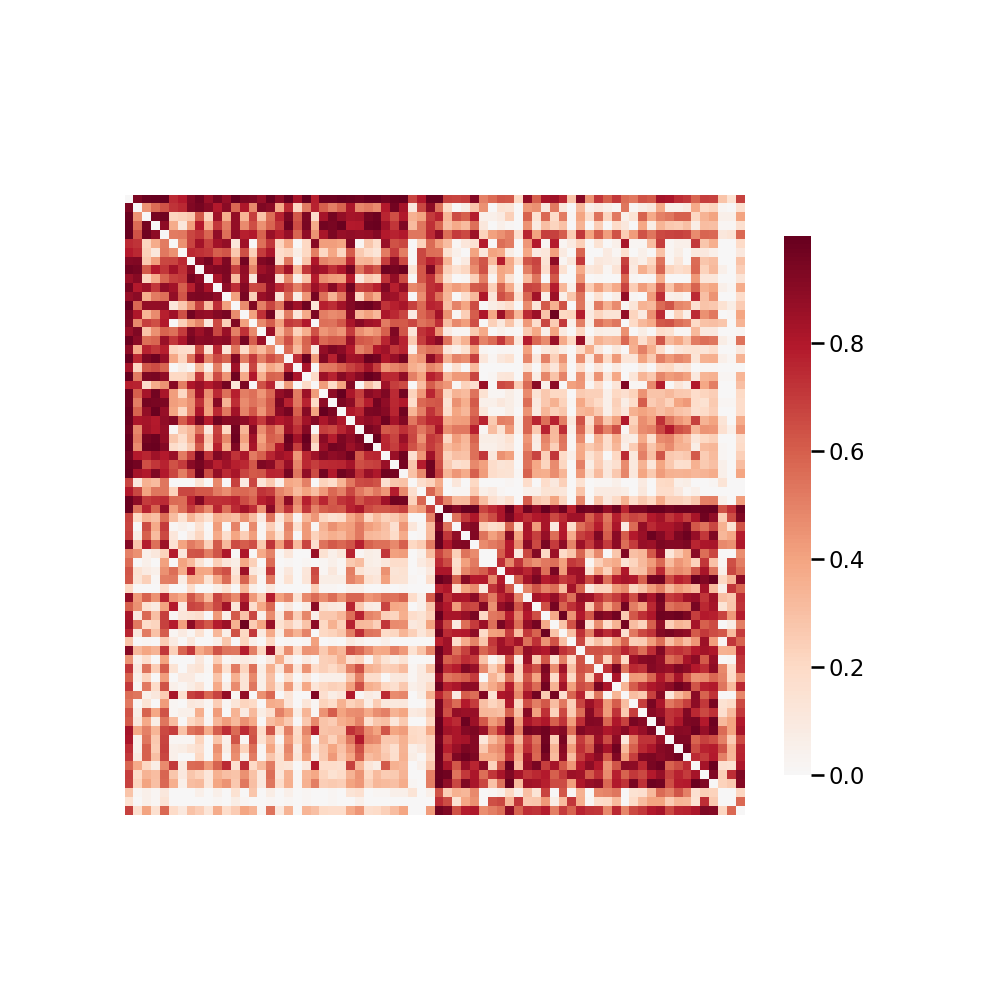

.. m2g_data documentation master file, created by
   sphinx-quickstart on Tue Mar 10 15:24:51 2020.
   You can adapt this file completely to your liking, but it should at least
   contain the root `toctree` directive.

******************
XHCUMS1
******************

Overview
-----------

XHCUMS - Xuanwu Hospital, Capital University of Medical Sciences

See http://fcon_1000.projects.nitrc.org/indi/CoRR/html/xhcums_1.html for the website of the original dataset

**Sample Connectome** from sub-0025984_ses-4_dwi_desikan_space-MNI152NLin6_res-2x2x2_connectome.png

All Data Download Instructions
-------------------------------------

Download from S3

The most recently published snapshot can be downloaded from S3. This method is best for larger datasets or unstable connections. This example uses AWS CLI: https://aws.amazon.com/cli/?nc1=h_ls/

**Diffusion MRI result**::

	aws s3 sync --no-sign-request s3://ndmg-data/XHCUMS/XHCUMS-m2g-dwi-05-03-20-csa-det-native <your_local_direction>
	
	
Example: 

``aws s3 sync --no-sign-request s3://ndmg-data/XHCUMS/XHCUMS-m2g-dwi-05-03-20-csa-det-native .``

	

**Functional MRI result**::

    aws s3 sync --no-sign-request s3://ndmg-data/XHCUMS/XHCUMS-m2g-func-04-15-20 <your_local_direction>
	
Example: 

``aws s3 sync --no-sign-request s3://ndmg-data/XHCUMS/XHCUMS-m2g-func-04-15-20 .``

Single Sample Download Instructions
----------------------------------------

**Diffusion MRI single sample**::
    
    aws s3 sync --no-sign-request s3://ndmg-data/XHCUMS/XHCUMS-m2g-dwi-05-03-20-csa-det-native/<subject_number> <your_local_direction>

Example: 

``aws s3 sync --no-sign-request s3://ndmg-data/XHCUMS/XHCUMS-m2g-dwi-05-03-20-csa-det-native/sub-0025982 .``

======	==============================
index	subject_number
======	==============================
1    	sub-0025982
2    	sub-0025983
3    	sub-0025984
4    	sub-0025985
5    	sub-0025986
6    	sub-0025987
7    	sub-0025988
8    	sub-0025989
9		sub-0025990
10    	sub-0025991
11    	sub-0025992
12    	sub-0025993
13    	sub-0025994
14    	sub-0025995
15    	sub-0025996
16    	sub-0025997
17    	sub-0025998
18    	sub-0026000
19		sub-0026001
20    	sub-0026002
21    	sub-0026003
22    	sub-0026004
23    	sub-0026005
24    	sub-0026006
======	==============================

**Functional MRI single sample**::
    
    aws s3 sync --no-sign-request s3://ndmg-data/XHCUMS/XHCUMS-m2g-func-04-15-20/<subject_number> <your_local_direction>

Example: 

``aws s3 sync --no-sign-request s3://ndmg-data/XHCUMS/XHCUMS-m2g-func-04-15-20/sub-0025982 .``

======	==============================
index	subject_number
======	==============================
1    	sub-0025982
2    	sub-0025983
3    	sub-0025984
4    	sub-0025985
5    	sub-0025986
6    	sub-0025987
7    	sub-0025988
8    	sub-0025989
9		sub-0025990
10    	sub-0025991
11    	sub-0025992
12    	sub-0025993
13    	sub-0025994
14    	sub-0025995
15    	sub-0025996
16    	sub-0025997
17    	sub-0025998
18    	sub-0026000
19		sub-0026001
20    	sub-0026002
21    	sub-0026003
22    	sub-0026004
23    	sub-0026005
24    	sub-0026006
======	==============================